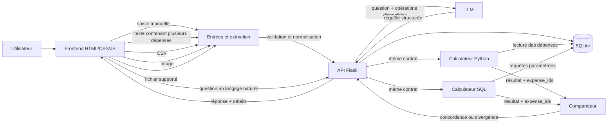

# SPEC : Le Sosie

## Le problème (5 lignes)

Lorsqu'un utilisateur demande à une IA d'analyser ses dépenses, une réponse chiffrée peut sembler crédible tout en étant fausse ou impossible à vérifier. Le Sosie permet à l'utilisateur de fournir ses propres dépenses de plusieurs façons puis de poser une question en langage naturel, par exemple « Combien ai-je dépensé en alimentation ce mois-ci ? ». La demande est transformée en une opération structurée puis envoyée à deux méthodes de calcul indépendantes, une en Python et une en SQL, travaillant sur les mêmes données. Les deux résultats sont ensuite comparés, avec les dépenses ayant participé au calcul. Le système affiche le résultat lorsque les deux méthodes concordent et signale clairement toute divergence au lieu de choisir arbitrairement une réponse.

## User stories (3 max)

1. **En tant qu'utilisateur**, je veux fournir mes dépenses de différentes façons afin que Le Sosie puisse travailler uniquement à partir de mes propres données.

2. **En tant qu'utilisateur**, je veux poser une question sur mes dépenses en langage naturel afin d'obtenir un calcul réalisé indépendamment par Python et SQL.

3. **En tant qu'utilisateur**, je veux voir les résultats des deux méthodes et les dépenses utilisées afin de comprendre si les deux calculs concordent et de pouvoir vérifier la réponse.

## Hors scope (10 items)

- Pas de connexion bancaire, d'Open Banking ou d'accès direct à un compte bancaire.
- Pas de récupération automatique de transactions depuis une banque ou un service financier externe.
- Pas de prise en charge de tous les formats de fichiers existants : seuls les formats explicitement supportés par l'application sont acceptés.
- Pas d'adaptation automatique à tous les formats d'exports bancaires existants.
- Pas de prédiction des dépenses futures, de conseil financier ou de recommandation d'investissement.
- Pas de conversion entre plusieurs devises : les montants du MVP sont exprimés en euros.
- Pas de catégorisation automatique des dépenses par IA : la catégorie doit être fournie ou validée par l'utilisateur.
- Pas de génération libre de requêtes SQL par le LLM : seules des opérations définies et des requêtes SQL paramétrées sont exécutées.
- Pas de gestion avancée des comptes, organisations, rôles ou budgets partagés dans le MVP.
- Pas de troisième moteur de calcul chargé de déterminer systématiquement lequel de Python ou SQL a raison : en cas de divergence impossible à expliquer avec les données disponibles, Le Sosie indique qu'il ne peut pas valider le résultat.

## Entrée des dépenses

L'utilisateur peut fournir ses dépenses de plusieurs façons.

### Saisie d'une dépense

L'utilisateur peut saisir une dépense directement dans l'interface.

Exemple :

```text
date: 2026-09-01
description: Carrefour
categorie: Alimentation
montant: 42.50
```

### Saisie de plusieurs dépenses

L'utilisateur peut également fournir plusieurs dépenses en une seule fois sous forme de texte structuré.

Exemple :

```text
01/09 Carrefour 42,50 € alimentation
02/09 Essence 65 € transport
03/09 Netflix 19,99 € abonnement
```

Les données reconnues doivent être transformées vers le format interne commun avant d'être enregistrées.

### Fichier CSV

Le format CSV de référence est :

```csv
date,description,categorie,montant
2026-09-01,Carrefour,Alimentation,42.50
2026-09-02,Essence,Transport,65.00
2026-09-03,Netflix,Abonnements,19.99
```

### Image

L'utilisateur peut envoyer une image contenant des informations de dépense, par exemple :

- ticket de caisse ;
- facture ;
- capture d'écran ;
- photo d'un justificatif.

Les informations utiles sont extraites puis transformées vers le format interne commun.

Une information extraite d'une image n'est jamais considérée comme fiable uniquement parce qu'elle a été reconnue automatiquement.

### Autres fichiers

D'autres formats pourront être pris en charge uniquement s'ils sont explicitement définis par le projet.

Un format non supporté doit être refusé clairement plutôt que traité approximativement.

## Format interne des données

Quelle que soit la méthode utilisée pour fournir une dépense, toutes les données doivent être normalisées vers la même structure.

```text
Expense

id
date
description
category
amount_cents
source_type
```

Exemple :

```text
id: 12
date: 2026-09-01
description: Carrefour
category: Alimentation
amount_cents: 4250
source_type: csv
```

`source_type` permet de savoir comment la dépense a été fournie.

Exemples :

```text
manual
text
csv
image
file
```

Règles principales :

- date valide ;
- description obligatoire ;
- catégorie obligatoire ;
- montant en euros ;
- montant stocké en centimes entiers après validation ;
- aucune donnée invalide ne doit être utilisée silencieusement dans un calcul;
- si la catégorie manque ou ne peut pas être déterminée avec certitude, elle doit être demandée ou validée par l'utilisateur avant l'enregistrement. 

Chaque dépense validée reçoit un identifiant permettant de retrouver les données ayant participé à un résultat.

## Normalisation

Toutes les méthodes d'entrée passent par une étape commune :

```text
Entrée utilisateur
        |
        v
Extraction
        |
        v
Validation
        |
        v
Normalisation
        |
        v
Expense
        |
        v
SQLite
```

Python et SQL ne travaillent pas directement sur les fichiers, les images ou le texte original.

Ils travaillent uniquement sur les dépenses validées et normalisées enregistrées dans la base.

Cela garantit que les deux méthodes utilisent la même source de données.

## Schéma d'architecture



- **Front** : permet de fournir les dépenses, poser une question et consulter les résultats.
- **Entrées et extraction** : récupère les informations provenant d'une saisie, d'un texte, d'un CSV, d'une image ou d'un autre fichier supporté.
- **Back** : valide et normalise les données, orchestre le LLM, lance les deux méthodes de calcul et applique les règles de comparaison.
- **Agent** : comprend la demande en langage naturel et la transforme en une opération structurée parmi celles autorisées. Il ne calcule pas lui-même le résultat final.
- **Calculateur Python** : filtre et additionne les dépenses avec du code Python.
- **Calculateur SQL** : réalise le même calcul avec des requêtes SQL prédéfinies et paramétrées.
- **Comparateur** : compare les valeurs retournées et les dépenses ayant participé au calcul.
- **Stockage** : SQLite contient uniquement les dépenses validées et normalisées.
- **Isolation** : les deux calculateurs travaillent à partir des mêmes données mais réalisent leur calcul indépendamment.

## Opérations prévues

Le périmètre initial comporte trois opérations.

### Total des dépenses

Exemple :

> Combien ai-je dépensé au total ?

Contrat :

```text
operation: total
```

### Total par catégorie

Exemple :

> Combien ai-je dépensé en alimentation ?

Contrat :

```text
operation: total_by_category
category: Alimentation
```

### Total sur une période

Exemple :

> Combien ai-je dépensé entre le 1er et le 7 septembre ?

Contrat :

```text
operation: total_by_period
start_date: 2026-09-01
end_date: 2026-09-07
```

Une demande ambiguë doit entraîner une demande de précision.

Exemple :

> Combien ai-je dépensé récemment ?

Le système ne choisit pas lui-même ce que signifie « récemment ».

## Endpoints REST prévus

- `POST /expenses` : ajouter une dépense manuellement.
- `POST /expenses/bulk` : fournir plusieurs dépenses en une seule fois.
- `POST /imports` : envoyer un fichier supporté.
- `GET /expenses` : consulter les dépenses du jeu de données courant.
- `POST /chat` : poser une question en langage naturel.
- `GET /calculations/{calculation_id}` : consulter le détail d'un calcul.
- `GET /health` : vérifier l'état de l'application.

Ces endpoints représentent le besoin actuel du palier 1 et pourront être adaptés pendant l'implémentation si nécessaire.

## Outils du système

Le LLM détermine l'opération demandée et ses paramètres.

Le backend impose ensuite l'exécution des deux calculateurs. Le modèle ne peut pas décider d'exécuter uniquement Python ou uniquement SQL.

| Nom | Signature | Effet de bord |
| --- | --- | --- |
| `calculate_python` | `calculate_python(request: CalculationRequest) -> ToolResult[CalculationResult]` | Non |
| `calculate_sql` | `calculate_sql(request: CalculationRequest) -> ToolResult[CalculationResult]` | Non |
| `get_expenses` | `get_expenses(expense_ids: list[ExpenseId]) -> ToolResult[list[Expense]]` | Non |

Les contrats détaillés sont définis dans `OUTILS.md`.

Un `CalculationResult` contient au minimum :

```text
result_cents
expense_ids
duration_ms
```

Exemple :

```text
result_cents: 7250
expense_ids: [1, 4, 7]
duration_ms: 3.4
```

Le LLM ne peut pas modifier directement le résultat retourné par Python ou SQL.

## Comparaison des deux Sosies

### Concordance

Exemple :

```text
Python : 72.50 €
SQL    : 72.50 €

Python expense_ids : [1, 4, 7]
SQL expense_ids    : [1, 4, 7]
```

Le résultat peut être validé.

Réponse :

> Vous avez dépensé 72,50 € en alimentation. Les calculs Python et SQL concordent.

### Même montant mais données différentes

Exemple :

```text
Python : 72.50 €
SQL    : 72.50 €

Python expense_ids : [1, 4, 7]
SQL expense_ids    : [2, 5]
```

Les montants sont identiques mais les preuves ne le sont pas.

Le système considère cela comme une divergence.

### Montants différents

Exemple :

```text
Python : 72.50 €
SQL    : 79.50 €
```

Le Sosie ne choisit pas arbitrairement l'un des deux résultats.

Il affiche les deux réponses et les dépenses utilisées par chaque méthode.

Si les données disponibles ne permettent pas d'expliquer complètement l'écart, aucune réponse n'est présentée comme validée.

## Indépendance des calculs

Le calculateur Python doit :

- récupérer les dépenses ;
- réaliser son propre filtrage ;
- réaliser son propre regroupement ;
- effectuer son propre cumul.

Le calculateur SQL doit :

- utiliser ses propres conditions SQL ;
- utiliser des requêtes paramétrées ;
- effectuer les opérations avec SQL.

Aucun des deux calculateurs ne doit :

- recevoir le résultat de l'autre ;
- réutiliser la sélection de lignes produite par l'autre ;
- modifier son résultat pour le faire correspondre à l'autre.

La validation et la normalisation des données restent communes aux deux calculateurs.

Le Sosie vérifie donc principalement deux méthodes de calcul indépendantes sur une même source de données, et non deux chaînes complètement indépendantes depuis l'entrée jusqu'au résultat.

## Mesure du coût

Pour chaque calcul, Le Sosie mesure :

```text
durée Python
durée SQL
durée totale
```

Ces informations permettent de montrer le coût de la double exécution pendant la démonstration.

Les deux calculs peuvent être lancés en parallèle afin d'éviter que leur durée totale corresponde simplement à l'addition des deux temps d'exécution.

## Happy path de la démo finale (6 étapes)

1. L'utilisateur importe un CSV contenant plusieurs dépenses.
2. L'application valide et normalise les données puis affiche les dépenses enregistrées.
3. L'utilisateur demande : « Combien ai-je dépensé en alimentation ? »
4. L'agent transforme la question en une requête structurée `total_by_category` avec la catégorie `Alimentation`, puis le backend lance les calculateurs Python et SQL avec exactement les mêmes paramètres.
5. Les deux calculateurs retournent `72,50 €` avec les mêmes identifiants de dépenses et le comparateur confirme la concordance.
6. L'interface affiche la réponse finale, les résultats Python et SQL, les dépenses ayant servi au calcul et la durée de chaque méthode.

## Répartition du travail

- **Noham** : backend, compréhension de la question, orchestration des deux calculateurs et logique de comparaison.
- **Jonathan** : frontend, saisie et import des dépenses, affichage des données, intégration des résultats et détails de comparaison.
- **En commun** : `SPEC.md`, modèle de données, normalisation des entrées, tests de concordance/divergence, architecture et script de démonstration.

## Bonus : Le non argumenté

> Pas de troisième moteur de calcul chargé de déterminer systématiquement lequel de Python ou SQL a raison.

Ajouter un troisième moteur pour départager Python et SQL ne supprimerait pas le problème de confiance.

Cela déplacerait simplement la question vers ce troisième moteur : pourquoi lui faire davantage confiance ?

Si Python et SQL divergent et que les données disponibles ne permettent pas d'expliquer l'écart, Le Sosie préfère indiquer qu'il ne peut pas valider le résultat plutôt que de choisir arbitrairement une réponse.